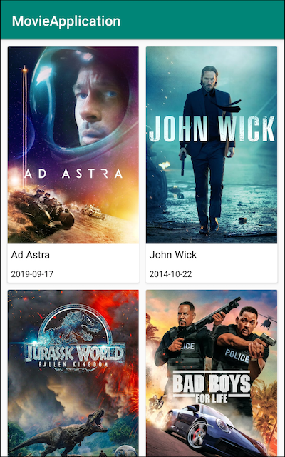
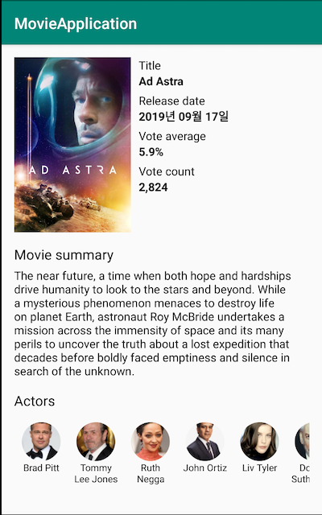

# Android Clean Architecture Study-02

 

## ToyProject
- Movie API를 사용한 클린아키텍처

### 구조

#### Presenter

- UI 부를 처리합니다.
- Activity, Fragment, ViewModel, Adapter)
- Presenter Model (실재 화면에 사용할 데이터)

#### Data

- 데이터를 처리합니다.
- API (Data Source 역활로 현 예제에서는 local은 없고 remote만 있습니다.)
- RepositoryImpl (레포지터리에서는 remote와 local에서 무엇을 사용할지 정합니다.)
- data model (respone, request와 같은 api 데이터)

#### Domain

- 비즈니스 로직을 처리합니다.
- repository interface 를 가지고 있습니다.
- repository를 받아 비즈니스 로직을 처리하는 Usecase
- domain model로 Entity를 가지고 있습니다.

### 화면 구성

1. Movie   

2. MovieDetail   

### API

[themoviedb](https://developers.themoviedb.org/3/getting-started/introduction)

### 참고 사이트

[Handling error](https://medium.com/@douglas.iacovelli/how-to-handle-errors-with-retrofit-and-coroutines-33e7492a912)
[BankSalad TestCode](https://blog.banksalad.com/tech/test-in-banksalad-android/?fbclid=IwAR3YOQi--5OZbMzuzpdbDkm45kwclqfvq0lDlN0shJRt3ROEuppOULi4oiU)
[Single LiveEvent](https://medium.com/androiddevelopers/livedata-with-snackbar-navigation-and-other-events-the-singleliveevent-case-ac2622673150)

[CleanArchitecture Guide](https://proandroiddev.com/clean-architecture-data-flow-dependency-rule-615ffdd79e29)

[BaseRecyclerView](https://medium.com/@dss99911/simple-android-architecture-recyclerview-ef5fdd7dac0a)

